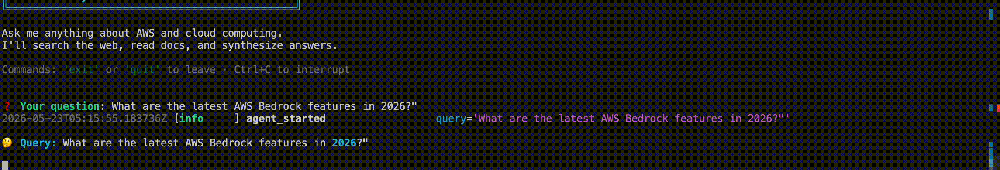
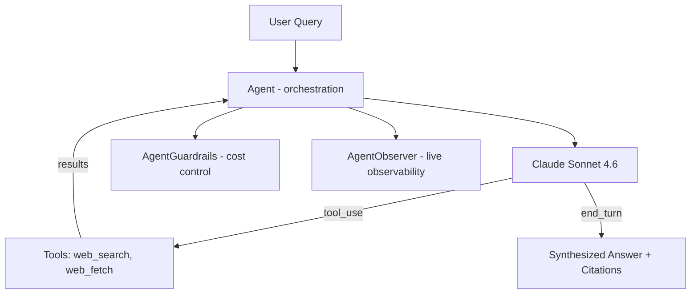

# AWS Research Agent

> An autonomous AI research agent for AWS and cloud computing topics. Built with Claude Sonnet 4.6 tool use via the Anthropic SDK directly (no LangChain). Features multi-tool reasoning, cost guardrails, and real-time observability.



[](https://github.com/HenryGlo/aws-research-agent/actions)
[](https://www.python.org/downloads/)
[](LICENSE)

---

## 🎯 What It Does

Given a question about AWS or cloud computing, the agent autonomously:

1. **Decides** which tools to use (web search, page fetching)
2. **Searches** the web for current information
3. **Fetches** full content from the most relevant sources
4. **Synthesizes** a structured answer with citations

All while tracking cost in real time and enforcing safety limits to prevent runaway loops.

---

## ✨ Key Features

- **Direct Anthropic SDK** — built on Claude's raw tool-use protocol, not LangChain. Full control over the agent loop and complete observability.
- **Cost guardrails** — circuit breakers for token budget, cost ceiling, iteration limits, and loop detection. The agent gracefully synthesizes when limits are hit instead of crashing.
- **Real-time observability** — every decision (which tool, why, how much it cost) is surfaced live as the agent reasons.
- **Graceful failure** — when information isn't publicly available, the agent acknowledges it honestly instead of looping endlessly.
- **Modular architecture** — separation of concerns across three components: orchestration, guardrails, and observability.

---

## 🏗️ Architecture

The agent is built from three independent, single-responsibility components:



- **`Agent`** (`loop.py`) — orchestrates the tool-use loop
- **`AgentGuardrails`** (`guardrails.py`) — token budget, cost ceiling, loop detection
- **`AgentObserver`** (`observer.py`) — real-time reasoning display

---

## 🧠 The Agent Loop

The core protocol, implemented directly on the Anthropic SDK:

1. Send the query to Claude **with available tools**
2. Claude responds with `stop_reason`:
   - `tool_use` → Claude wants to run a tool
   - `end_turn` → Claude has a final answer
3. If `tool_use`: execute the tool locally, feed results back
4. Loop until `end_turn` (or a guardrail triggers graceful synthesis)

**Key insight:** the model decides *what* to do; the code decides *when to stop it from doing too much*. Control flow is shared between the LLM and the guardrails.

---

## 🛡️ Cost Guardrails

A standalone, unit-tested component that prevents runaway agents:

| Guardrail | Default | Purpose |
|-----------|---------|---------|
| Token budget | 50,000 input tokens | Prevents context bloat |
| Cost ceiling | $0.50 per query | Hard cost cap |
| Max iterations | 10 | Prevents infinite loops |
| Loop detection | 2 duplicate queries | Catches "rephrase and retry" loops |

When any limit triggers, the agent **forces a synthesis** with what it has gathered — returning a useful partial answer instead of crashing.

---

## 📊 Real Performance

Example run on a deliberately hard query ("exact rate limits for Claude Sonnet 4.6 on AWS Bedrock" — information AWS doesn't fully publish):

| Metric | Value |
|--------|-------|
| Iterations | 3 |
| Tool calls | 3 (search → fetch → search) |
| Total tokens | ~11,500 |
| Cost | ~$0.05 |
| Outcome | Honest synthesis acknowledging what's public vs not |

**Before guardrails**, the same query ran 10 iterations, 116K tokens, hit rate limits, and produced no answer. See [Lessons Learned](#-lessons-learned).

---

## 🛠️ Tech Stack

**AI:** Claude Sonnet 4.6 (Anthropic SDK), tool use

**Tools:** Tavily (web search), httpx + BeautifulSoup (web fetch)

**Backend:** Python 3.11, Pydantic, structlog, rich

**Quality:** pytest, ruff, GitHub Actions (CI)

---

## 🚀 Quick Start

```bash
git clone https://github.com/HenryGlo/aws-research-agent.git
cd aws-research-agent

python3.11 -m venv .venv
source .venv/bin/activate
pip install -e ".[dev]"

cp .env.example .env
# Edit .env: add ANTHROPIC_API_KEY and TAVILY_API_KEY

# Interactive CLI
python -m scripts.cli
```

---

## 📐 Design Decisions

### Why the Anthropic SDK directly instead of LangChain?

Building on the raw tool-use protocol means full control over the agent loop, transparent cost tracking, and the ability to debug exactly what the model decides. Frameworks abstract this away — useful for speed, but they hide the mechanics that matter most in production (cost, latency, failure modes).

### Why separate Guardrails and Observer classes?

Separation of concerns. The agent orchestrates; guardrails enforce limits; the observer reports. Each is independently testable. Guardrails have full unit-test coverage with no API calls.

### Why graceful failure over exhaustive search?

Some questions don't have public answers. An agent that searches endlessly burns budget and hits rate limits. Explicitly granting the model "permission to fail" — via the system prompt and guardrails — produces honest, useful answers and controls cost.

---

## 🧪 Testing

```bash
pytest tests/ -v
```

Tests cover guardrail logic (token budget, cost ceiling, loop detection — no API calls) and the web_fetch tool (mocked HTTP). CI runs lint + tests on every push.

---

## 📚 Lessons Learned

- **Agents don't know when to give up.** Without explicit guidance, an LLM agent will keep searching for information that doesn't exist, burning tokens until it hits rate limits. The fix is granting "permission to fail" in the system prompt.
- **Context bloat is real.** Each fetched page accumulates in the conversation history. Capping fetch size and limiting tool calls per query is essential for cost control.
- **Control flow is shared.** In agentic systems, the model decides what to do; your code decides operational limits. Guardrails are how you enforce those limits independently of the model's decisions.
- **Self-imposed cost ceilings prevent disasters.** A circuit breaker on token budget turned a $0.40+ runaway query into a $0.05 graceful answer.

---

## 🗺️ Roadmap

- [ ] **RAG retrieval tool** — integrate a knowledge base as a third tool
- [ ] **Code execution tool** — sandboxed Python for calculations (e.g., AWS cost estimates)
- [ ] **Streaming responses** — token-by-token output for better UX
- [ ] **REST API** — FastAPI wrapper for programmatic access
- [ ] **Cross-family judge** — evaluate answer quality with a different model
- [ ] **Conversation memory** — multi-turn context across questions

---

## 📄 License

MIT License — see [LICENSE](LICENSE) for details.

---

## 👤 Author

**Henry Gomez Lofiego**
Senior ML Engineer | RAG & LLM Specialist | Master's in Data Science (in progress)

- [LinkedIn](https://www.linkedin.com/in/henry-gomez-lofiego/)
- 📧 henrylofiego@gmail.com
- 🌎 Based in Venezuela · Open to remote roles globally